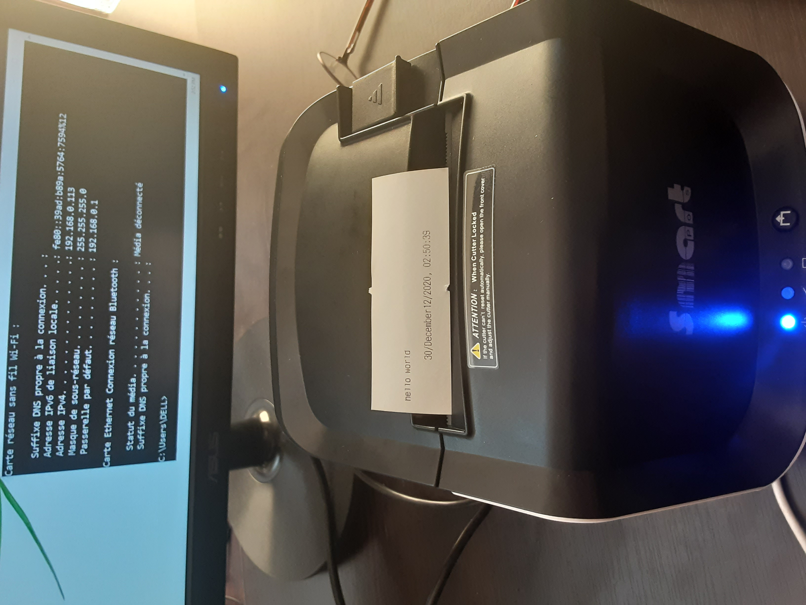
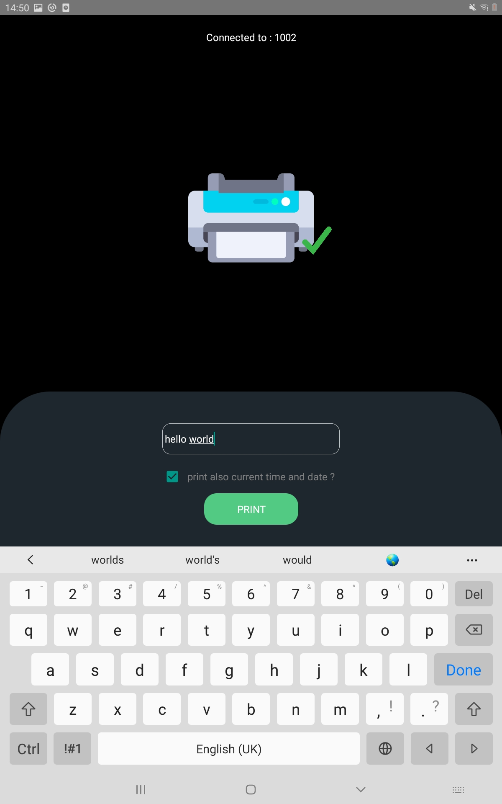
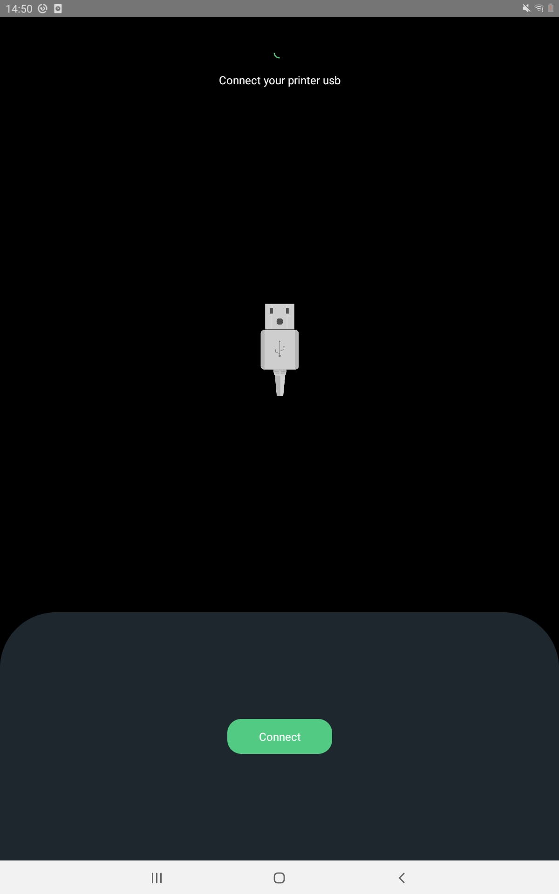

# PrintingAppReactNative

connect rn app with hardware printer and print ticket from json data

## react-native-usb-printer app demo :

“react-native-usb-printer” that supports for Android Platform. It is very easy to use. It detects all connected USB Printer to our device , with the possibility to print text input and current time

## current progress :

connected screen | screen desconnected
:-------------------------:|:-------------------------:
 | 

## ------------------

- free open source Made with ❤ in Algeria  
  by : <a href= 'https://www.linkedin.com/in/ilies-ould-menouer-6a02111a2/' >ilies Ouldmenouer</a>
